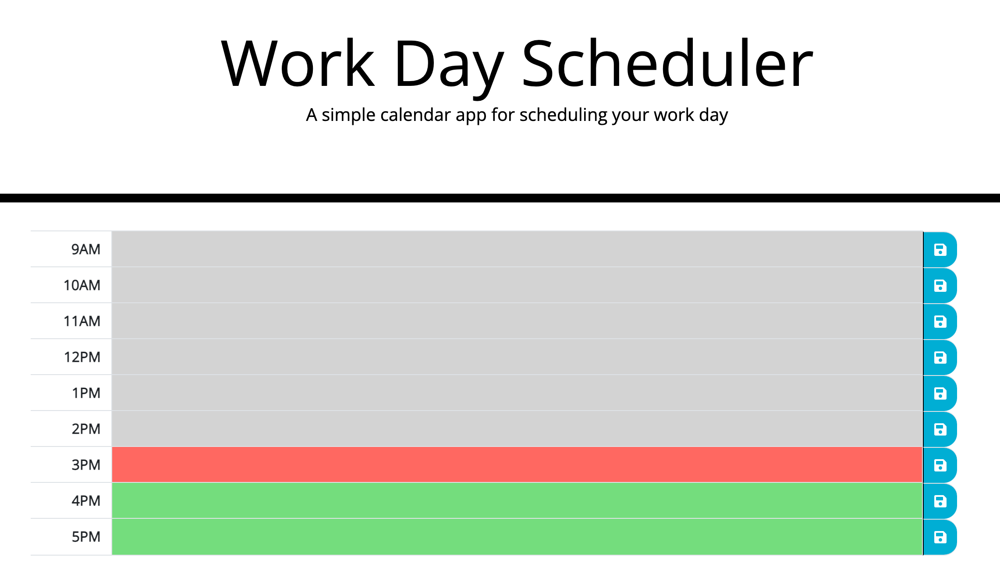

# Daily Planner

## Description

This application was an opportunity to practice using third-party APIs. It leverages bootstrap, jQuery and Moment.js to create a simple daily-planner application.

I was given some starter code for the beginning of the application, but I had to build the HTML table and all of its behavior. Leveraging bootstrap made the table creation especially easy. Much of the jQuery felt similar to things I'd previosly done using vanilla JavaScript, but the Moment.js library was new territory for me.

## Usage

The following screenshot depicts the final deployed application. 

To see the application in action, navigate to the deployed application [here](https://cleave13.github.io/daily-planner/).

- When the page initially loads, you will notice that all hours in the past have a gray background color. The current hour is colored red, while future working hours are colored in green.
- Users can click into any of the shaded cells in the table and enter the event(s) for that hour.
- Clicking the save icon to the right of the row commits the item to local storage so that the calendar item(s) persist even when the page is reloaded.

The source code for this project can be viewed [here](https://github.com/cleave13/daily-planner/).